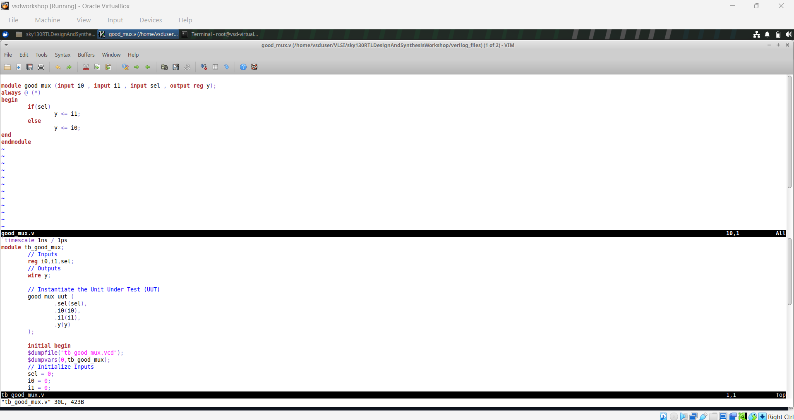
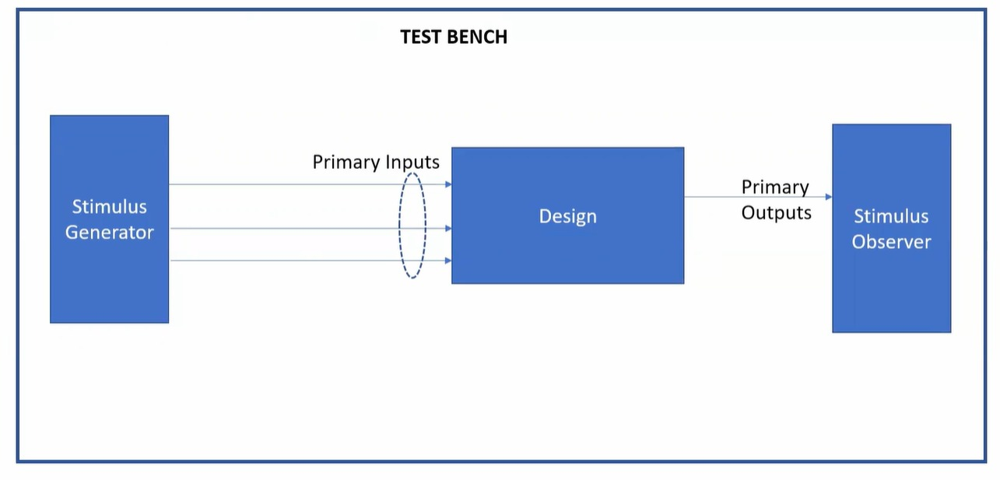
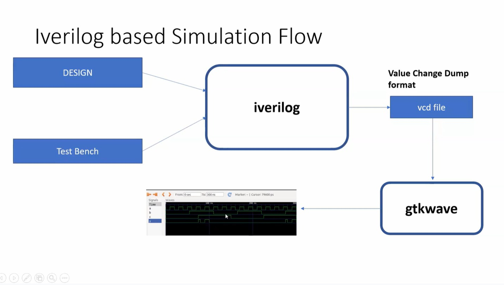
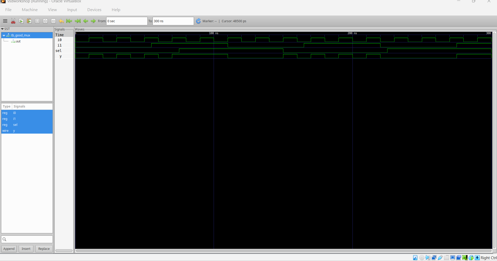
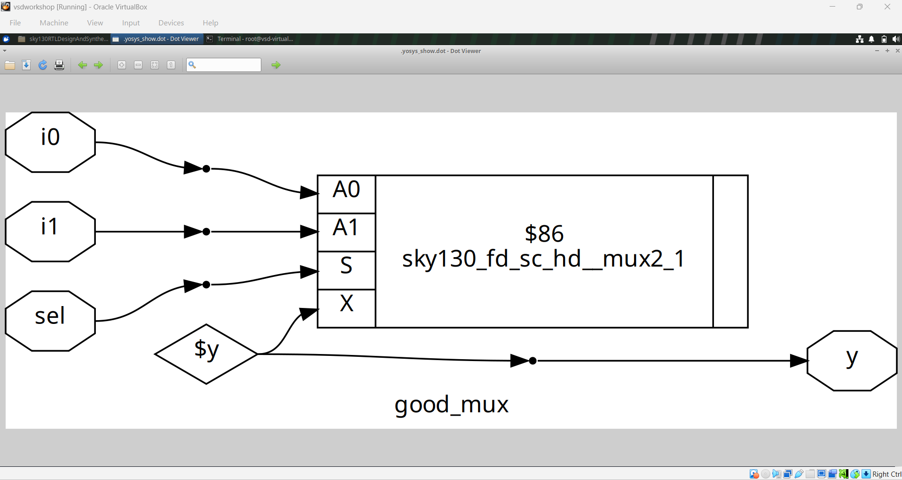
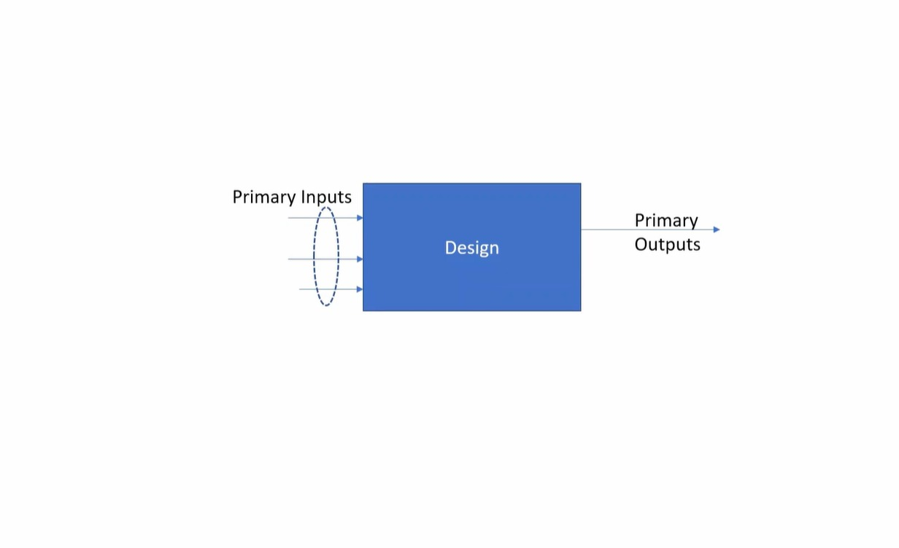

# Module 1 — Introduction to RTL Design and Simulation

## Overview

This module introduces the basic RTL design and verification flow using a simple **2:1 multiplexer (`good_mux`)** as the design example.

The work documented here covers:

- RTL design of a 2:1 multiplexer
- Testbench structure
- Icarus Verilog based simulation flow
- Value Change Dump (VCD) generation
- GTKWave waveform observation
- RTL-to-synthesis representation of the multiplexer

---

## Table of Contents

1. [Module Objectives](#1-module-objectives)
2. [Design Under Test](#2-design-under-test)
3. [Testbench Structure](#3-testbench-structure)
4. [RTL and Testbench Implementation](#4-rtl-and-testbench-implementation)
5. [Icarus Verilog Simulation Flow](#5-iverilog-simulation-flow)
6. [Waveform Analysis](#6-waveform-analysis)
7. [Synthesis Result](#7-synthesis-result)
8. [Key Observations](#8-key-observations)
9. [Conclusion](#9-conclusion)

---

## 1. Module Objectives

The objective of this module is to understand the basic path from an RTL description to simulation and synthesized hardware representation.

The main practical activities are:

- Write the RTL for a simple combinational circuit.
- Create a testbench to provide input stimulus.
- Simulate the design using Icarus Verilog.
- Generate a VCD file containing signal transitions.
- Open the VCD in GTKWave and inspect the waveform.
- Observe the synthesized hardware representation.

---

## 2. Design Under Test

The design used in this module is a **2:1 multiplexer** named `good_mux`.

The multiplexer has:

- `i0` — first data input
- `i1` — second data input
- `sel` — select input
- `y` — output

The functional behavior is:

```text
sel = 0  →  y = i0
sel = 1  →  y = i1
```

### RTL Design

The RTL and testbench are captured in the following figure:



---

## 3. Testbench Structure

A testbench provides stimulus to the design and observes its outputs.

The supplied figure illustrates the relationship between:

```text
Stimulus Generator
        |
        v
   Primary Inputs
        |
        v
      Design
        |
        v
   Primary Outputs
        |
        v
  Stimulus Observer
```



The separation between the design and its testbench makes it possible to verify the RTL behavior without modifying the design itself.

---

## 4. RTL and Testbench Implementation

The `good_mux` RTL describes the combinational selection behavior.

The testbench supplies values for the inputs and records the output behavior.


The experiment uses a VCD dump so that the simulated signal activity can later be examined in GTKWave.

---

## 5. Icarus Verilog Simulation Flow

The module uses an **Icarus Verilog based simulation flow**.

The supplied flow diagram shows:

```text
        DESIGN
          +
       TEST BENCH
          |
          v
       iverilog
          |
          v
   Value Change Dump
       (.vcd)
          |
          v
       GTKWave
```



The simulation flow therefore connects the RTL and testbench to the waveform viewer through the generated VCD file.

---

## 6. Waveform Analysis

After simulation, the generated waveform can be inspected using GTKWave.



The waveform is used to compare the simulated output `y` against the applied values of `i0`, `i1`, and `sel`.

The expected functional relationship is:

```text
sel = 0 → output follows i0
sel = 1 → output follows i1
```

---

## 7. Synthesis Result

The synthesized representation of `good_mux` shows the combinational multiplexer mapped into a standard-cell implementation.



This provides the first connection between the RTL description and the hardware structure generated by synthesis.

---

## 8. Key Observations

| Stage | What is observed |
|---|---|
| RTL | A 2:1 multiplexer is described using Verilog |
| Testbench | Input stimulus is applied and the output is observed |
| Simulation | Icarus Verilog executes the RTL and testbench |
| VCD | Signal transitions are recorded for waveform viewing |
| GTKWave | Simulated signals can be inspected graphically |
| Synthesis | The RTL multiplexer is represented as hardware logic |

### Design I/O Representation

The supplied material also contains a view showing the relationship between primary inputs, the design and primary outputs.



---

## 9. Conclusion

Module 1 establishes the basic RTL design and verification workflow:

```text
RTL Design
    ↓
Testbench
    ↓
Icarus Verilog Simulation
    ↓
VCD Generation
    ↓
GTKWave Waveform Analysis
    ↓
Synthesis Representation
```

The `good_mux` example provides a simple starting point for understanding how a Verilog RTL description is simulated and then represented as synthesized hardware.

---

## Repository Structure

```text
Module 1/
├── README.md
└── images/
    ├── good_mux_synthesis.png
    ├── good_mux_waveform.png
    ├── good_mux_rtl_and_testbench.png
    ├── testbench_architecture.png
    ├── iverilog_simulation_flow.png
    └── design_input_output_view.png
```
