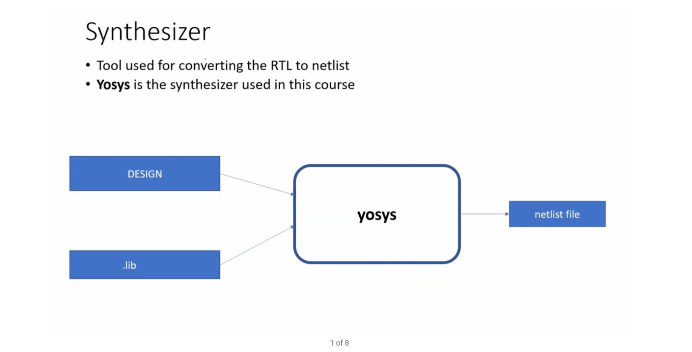
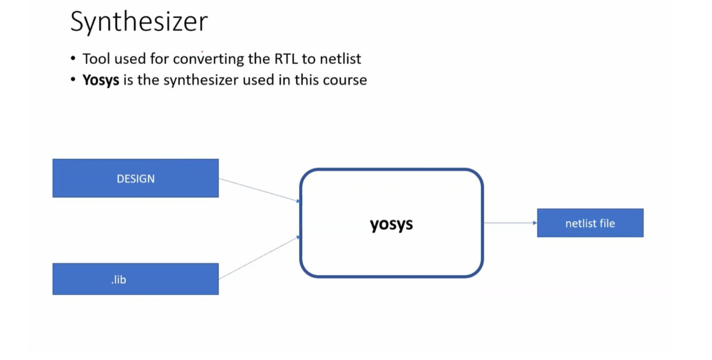
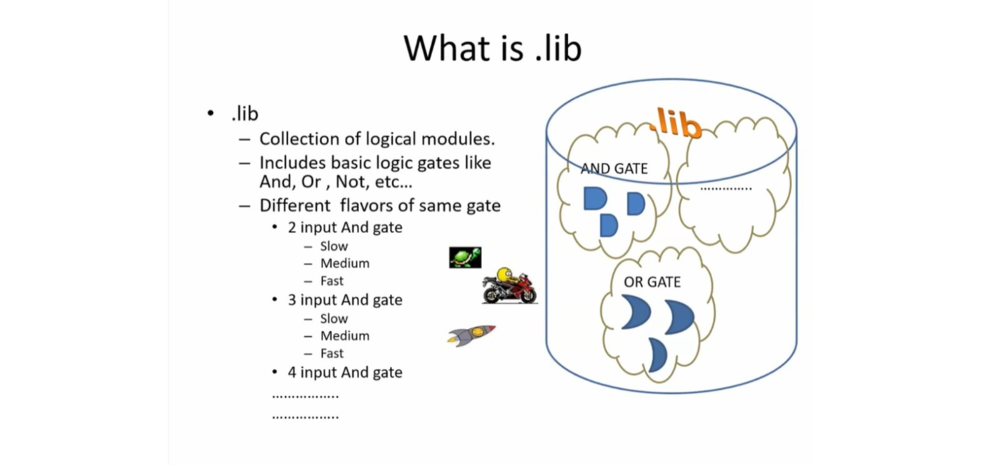
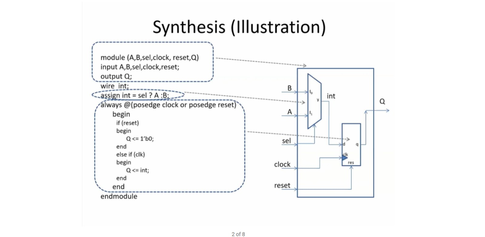
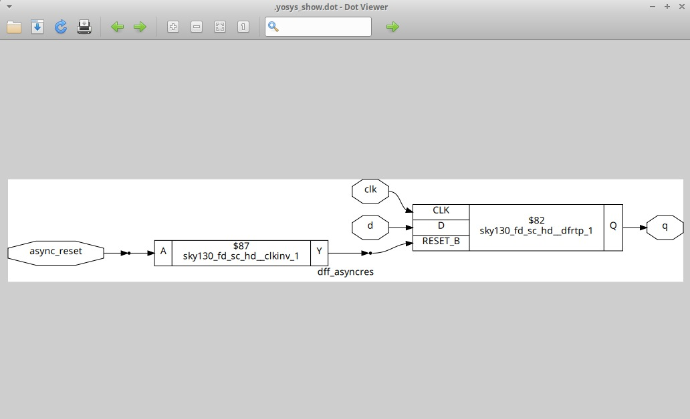
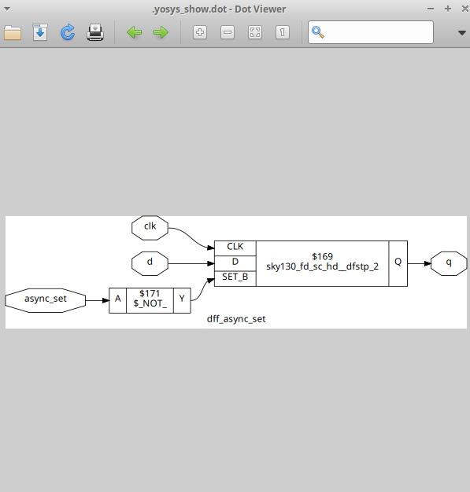
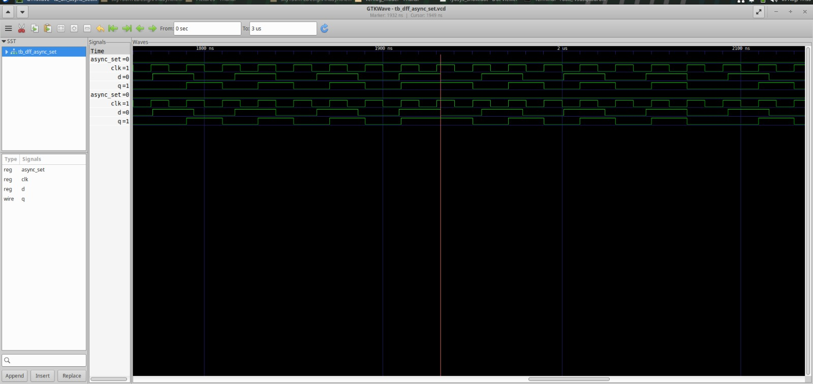
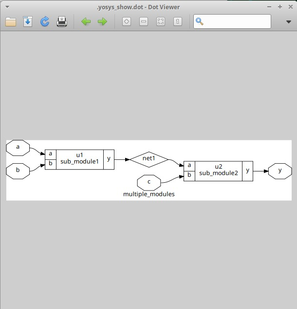
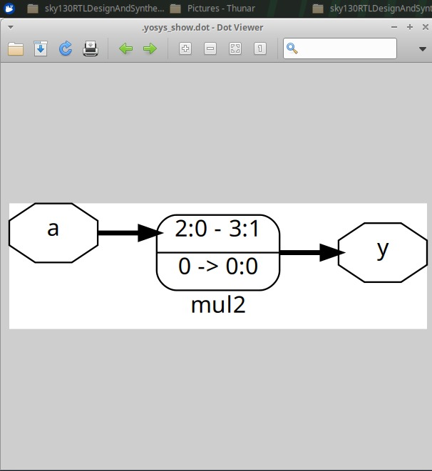

# Module 2 — Sequential Logic and RTL Synthesis

## Overview

This module focuses on the relationship between RTL descriptions, synthesis and standard-cell implementations.

The supplied figures cover:

- RTL-to-netlist synthesis
- Yosys as the synthesizer
- Standard-cell `.lib` files
- Synthesis illustration
- D flip-flop implementations with asynchronous controls
- Simulation waveforms
- Synthesized flip-flop structures
- Hierarchical RTL design
- Multiplier synthesis

---

## Table of Contents

1. [Module Objectives](#1-module-objectives)
2. [Synthesis Fundamentals](#2-synthesis-fundamentals)
3. [Understanding the .lib File](#3-understanding-the-lib-file)
4. [Synthesis Illustration](#4-synthesis-illustration)
5. [Sequential Logic — D Flip-Flop](#5-sequential-logic--d-flip-flop)
6. [Simulation Waveforms](#6-simulation-waveforms)
7. [Synthesized Flip-Flop Structures](#7-synthesized-flip-flop-structures)
8. [Hierarchical RTL Design](#8-hierarchical-rtl-design)
9. [Multiplier Synthesis](#9-multiplier-synthesis)
10. [Key Observations](#10-key-observations)
11. [Conclusion](#11-conclusion)

---

## 1. Module Objectives

This module develops an understanding of how RTL is transformed into synthesized hardware.

The figures supplied for this module are organized around:

- Synthesis using Yosys
- Standard-cell library concepts
- Sequential logic synthesis
- Waveform verification
- Hierarchical module representation
- Arithmetic logic synthesis

---

## 2. Synthesis Fundamentals

A synthesizer converts an RTL description into a netlist.

The supplied material identifies **Yosys** as the synthesizer used in the course.

The basic relationship is:

```text
Design / RTL
      +
    .lib
      |
      v
    Yosys
      |
      v
 Netlist File
```



A second supplied figure presents the same synthesis concept in a related form.



The `.lib` file supplies the library information used along with the design during synthesis.

---

## 3. Understanding the `.lib` File

The supplied material describes `.lib` as a collection of logical modules.

It includes basic logic such as:

- AND
- OR
- NOT
- Different input configurations
- Different variants of the same gate



The standard-cell library therefore provides the available cell implementations that can be used when mapping the design.

---

## 4. Synthesis Illustration

The following supplied figure illustrates how RTL constructs can correspond to a hardware structure containing combinational and sequential elements.



The illustration shows:

- Inputs `A` and `B`
- Select signal
- Clock
- Reset
- An intermediate combinational signal
- A registered output `Q`

This demonstrates the relationship between the RTL description and its synthesized hardware representation.

---

## 5. Sequential Logic — D Flip-Flop

The module includes synthesized representations of D flip-flop based sequential logic with asynchronous control signals.

### Asynchronous Reset

The synthesized structure below shows the asynchronous-reset implementation.



The structure contains the clock, data and reset-related paths leading to the synthesized flip-flop cell.

### Asynchronous Set

The supplied material also contains a synthesized asynchronous-set structure.



The synthesized representation shows the asynchronous control path together with the clock, data and registered output.

---

## 6. Simulation Waveforms

Waveform screenshots are included to document the simulated behavior of the sequential designs.

### Waveform — Experiment 1



### Waveform — Experiment 2


These waveform figures provide the simulation evidence corresponding to the sequential designs and their control signals.

---

## 7. Synthesized Flip-Flop Structures

The synthesized circuit views demonstrate how RTL sequential descriptions are mapped to standard-cell flip-flop structures.

The asynchronous reset implementation:


The asynchronous set implementation:


These figures make the RTL-to-cell mapping visible at the structural level.

---

## 8. Hierarchical RTL Design

The supplied synthesis figure also demonstrates a design composed of multiple modules.

The structure contains:

```text
        +---------------+
a ----->| sub_module1   |
b ----->|               |---- net1 ----+
        +---------------+              |
                                       v
                                +--------------+
c ----------------------------->| sub_module2 |----> y
                                +--------------+
```



This illustrates how separate RTL modules can be connected to form a larger design.

---

## 9. Multiplier Synthesis

A multiplier-related synthesis result is also included in the supplied material.



The synthesized representation shows the multiplier block and its input/output connectivity.

---

## 10. Key Observations

| Topic | Observation |
|---|---|
| Synthesizer | Yosys is used to convert RTL into a netlist |
| `.lib` | Contains the logical standard-cell library information |
| Sequential logic | Flip-flop structures are visible after synthesis |
| Asynchronous controls | Set/reset paths are represented in the synthesized structure |
| Simulation | Waveforms provide evidence of signal behavior |
| Hierarchical RTL | Multiple submodules can be connected into a larger design |
| Arithmetic logic | Multiplier RTL can also be synthesized and viewed structurally |

---

## 11. Conclusion

Module 2 connects RTL descriptions with their synthesized hardware representations.

The supplied figures demonstrate the flow:

```text
RTL Design
    ↓
Yosys
    ↓
Standard Cell Library (.lib)
    ↓
Synthesized Netlist
    ↓
Structural Circuit View
```

The module also demonstrates how sequential logic, asynchronous controls, hierarchical designs and multiplier logic appear during synthesis.

---

## Repository Structure

```text
Module 2/
├── README.md
└── images/
    ├── synthesis_flow_01.png
    ├── synthesis_flow_02.png
    ├── standard_cell_library.png
    ├── synthesis_illustration.png
    ├── dff_async_reset_synthesis.png
    ├── dff_waveform_01.png
    ├── hierarchical_design.png
    ├── dff_async_set_synthesis.png
    ├── dff_waveform_02.png
    └── multiplier_2_synthesis.png
```
