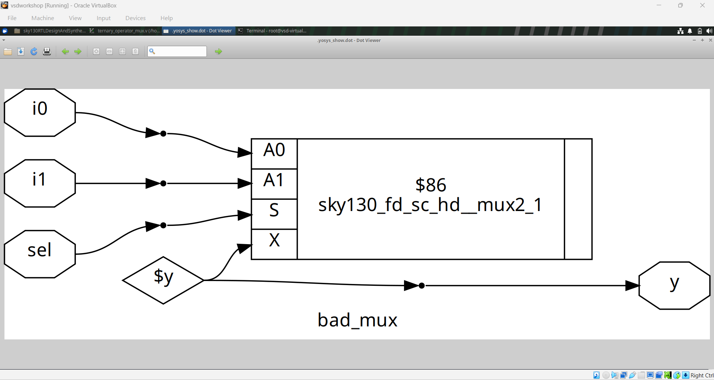
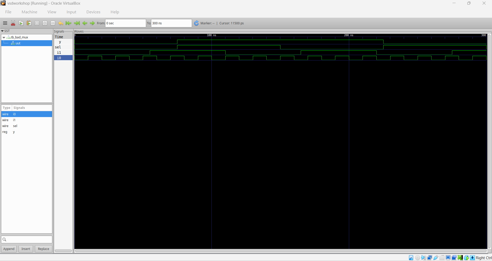
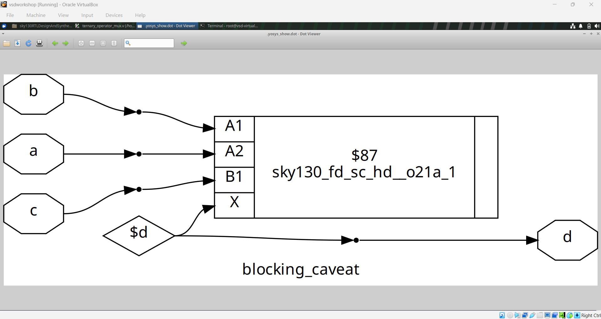
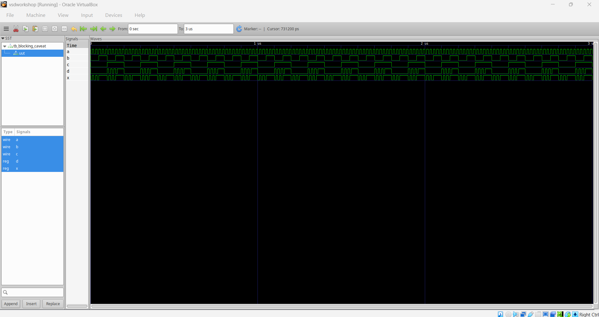

# Module 4: Gate-Level Simulation, Blocking vs Non-Blocking and Synthesis Simulation

This module focuses on important RTL and synthesis concepts involving **Gate-Level Simulation (GLS), blocking versus non-blocking assignments, combinational mux coding and synthesis-generated hardware**.

The experiments use Verilog RTL, simulation waveforms and synthesized gate-level diagrams to understand how coding style and simulation models affect hardware behavior.

---

## Table of Contents

- [1. Introduction](#1-introduction)
- [2. MUX Coding Styles](#2-mux-coding-styles)
  - [Ternary Operator MUX](#21-ternary-operator-mux)
  - [Bad MUX Sensitivity List](#22-bad-mux-sensitivity-list)
- [3. Blocking Assignment Caveat](#3-blocking-assignment-caveat)
- [4. Gate-Level Simulation](#4-gate-level-simulation)
- [5. RTL to Synthesis Simulation Flow](#5-rtl-to-synthesis-simulation-flow)
- [6. Key Takeaways](#6-key-takeaways)

---

# 1. Introduction

After writing RTL, it is important to understand both its simulation behavior and the hardware produced by synthesis.

This module concentrates on three closely related areas:

1. How different RTL descriptions represent the same combinational hardware.
2. How blocking assignments can introduce simulation-order dependencies.
3. How the synthesized gate-level netlist can be simulated to verify post-synthesis behavior.

The supplied screenshots show the RTL, synthesized logic and waveform results for these experiments.

---

# 2. MUX Coding Styles

A multiplexer can be described in Verilog in several ways. The coding style should accurately describe the intended combinational behavior.

## 2.1 Ternary Operator MUX

A 2:1 multiplexer can be written compactly using the conditional/ternary operator:

```verilog
module ternary_operator_mux (
    input i0,
    input i1,
    input sel,
    output y
);
assign y = sel ? i1 : i0;
endmodule
```

When `sel` is low, `i0` is selected. When `sel` is high, `i1` is selected.

### Synthesized Logic


The synthesized result shows a library MUX cell implementing the RTL functionality.

### Waveform


The waveform verifies that the output follows the selected input.

---

## 2.2 Bad MUX Sensitivity List

The following style uses an incomplete sensitivity list:

```verilog
module bad_mux (
    input i0,
    input i1,
    input sel,
    output reg y
);
always @(sel)
begin
    if (sel)
        y = i1;
    else
        y = i0;
end
endmodule
```

The combinational block reads `i0`, `i1` and `sel`, but the sensitivity list contains only `sel`.

Because changes in `i0` or `i1` do not trigger the `always` block, RTL simulation can fail to update `y` when an input changes.

This is an important example of why combinational blocks should include all signals that affect the block, commonly written using:

```verilog
always @(*)
```

### RTL / Synthesized Logic



### Waveform



The waveform demonstrates the simulation issue associated with the incomplete sensitivity list.

---

# 3. Blocking Assignment Caveat

Blocking assignments use `=` and update the assigned variable immediately within the procedural execution order.

For example:

```verilog
always @(*)
begin
    d = a & b;
    x = d & c;
end
```

The second statement sees the value assigned to `d` by the first statement during the same procedural execution.

This can be useful for combinational calculations, but the order of blocking assignments becomes important when intermediate signals depend on earlier assignments.

### RTL Code


### Synthesized Logic



### Waveform



The experiment illustrates the difference between the procedural simulation model and the hardware structure inferred by synthesis.

---

# 4. Gate-Level Simulation

**Gate-Level Simulation (GLS)** simulates a synthesized gate-level netlist instead of the original RTL.

A typical flow is:

```text
RTL
 |
 v
RTL Simulation
 |
 v
Synthesis
 |
 v
Gate-Level Netlist
 |
 v
Gate-Level Simulation
 |
 v
Waveform Comparison
```

GLS is useful for checking that the synthesized implementation behaves as expected and for observing effects that are not represented by an ideal RTL-only simulation.

### GLS Waveform


The supplied waveform is the verification evidence for the gate-level simulation experiment.

---

# 5. RTL to Synthesis Simulation Flow

The experiments in this module can be viewed as a practical RTL-to-gate verification flow:

### Step 1 — Write RTL

Describe the required combinational or sequential functionality in Verilog.

### Step 2 — Simulate RTL

Run the testbench and inspect the expected behavior in the waveform.

### Step 3 — Synthesize

Convert the RTL into a gate-level implementation using the target standard-cell library.

### Step 4 — Inspect the Netlist

Observe the cells selected by synthesis, such as MUX cells and logic gates.

### Step 5 — Run GLS

Simulate the synthesized netlist and inspect the waveform.

### Step 6 — Compare Results

Compare RTL simulation behavior with the gate-level simulation behavior.

---

# 6. Key Takeaways

This module provides practical understanding of:

- Ternary-operator MUX coding
- Combinational MUX implementation
- Incomplete sensitivity lists
- Simulation mismatches caused by poor combinational coding
- Blocking assignment behavior
- Procedural execution order
- Synthesis of RTL into standard-cell logic
- Gate-Level Simulation
- RTL versus gate-level verification

The key lesson is that **RTL coding style affects simulation behavior and the reliability of the synthesis flow**. Correct combinational sensitivity and appropriate procedural coding are essential for predictable results.
