# Module 5: Optimization in Synthesis

This module focuses on **synthesis-oriented RTL optimization** and demonstrates how coding styles such as complete/incomplete `if` and `case` statements, `case`-based logic and `generate` constructs affect the hardware inferred by synthesis.

The experiments include synthesized logic diagrams, RTL code screenshots and simulation waveforms for muxes, demuxes, incomplete combinational descriptions and a generated ripple-carry-adder structure.

---

## Table of Contents

- [1. Introduction](#1-introduction)
- [2. Incomplete Combinational Logic](#2-incomplete-combinational-logic)
  - [Incomplete IF](#21-incomplete-if)
  - [Incomplete IF 2](#22-incomplete-if-2)
  - [Incomplete CASE](#23-incomplete-case)
- [3. Complete CASE Logic](#3-complete-case-logic)
  - [Bad CASE Example](#31-bad-case-example)
  - [Complete CASE Example](#32-complete-case-example)
- [4. MUX and DEMUX Implementations](#4-mux-and-demux-implementations)
  - [MUX Using Generate](#41-mux-using-generate)
  - [DEMUX Using CASE](#42-demux-using-case)
  - [DEMUX Using Generate](#43-demux-using-generate)
- [5. Generate-Based Ripple Carry Adder](#5-generate-based-ripple-carry-adder)
- [6. Simulation and Verification](#6-simulation-and-verification)
- [7. Key Takeaways](#7-key-takeaways)

---

# 1. Introduction

Synthesis tools infer hardware from the behavior described by RTL.

For combinational logic, the RTL should describe an output for every possible input condition. If an output is not assigned in every required branch, synthesis can infer a **latch** to preserve the previous value.

This module demonstrates:

- Incomplete `if` statements
- Incomplete `case` statements
- Complete `case` statements
- MUX inference
- DEMUX implementation
- Generate-based structural RTL
- Synthesis-generated standard-cell logic
- Simulation of the resulting designs

The experiments show how RTL coding decisions can change the synthesized hardware.

---

# 2. Incomplete Combinational Logic

## 2.1 Incomplete IF

An incomplete `if` statement does not assign the output for every input condition.

Example:

```verilog
module incomp_if (
    input i0,
    input i1,
    input i2,
    output reg y
);
always @(*)
begin
    if (i0)
        y = i1;
end
endmodule
```

When `i0` is false, `y` is not assigned in the block. To preserve its previous value, synthesis can infer a latch.

### Synthesized Logic

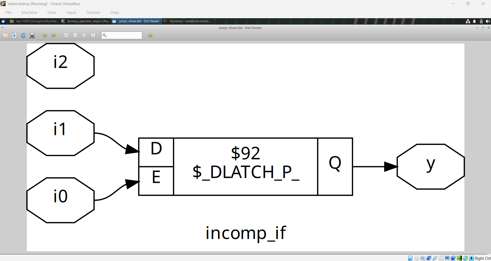

### Testbench Waveform


### Testbench Code


The experiment demonstrates how an incomplete combinational description can result in storage behavior.

---

## 2.2 Incomplete IF 2

This example uses an `if` / `else if` structure:

```verilog
module incomp_if2 (
    input i0,
    input i1,
    input i2,
    input i3,
    output reg y
);
always @(*)
begin
    if (i0)
        y = i1;
    else if (i2)
        y = i3;
end
endmodule
```

There is no final `else`, so there are input conditions for which `y` is not assigned.

### Synthesized Logic


The synthesized diagram contains a latch, demonstrating the hardware consequence of incomplete combinational assignment.

### Testbench Code

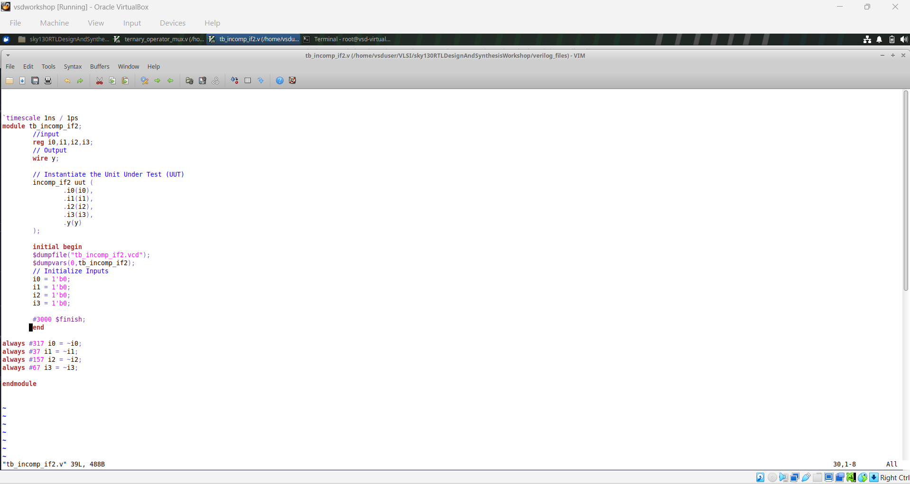

### Waveform

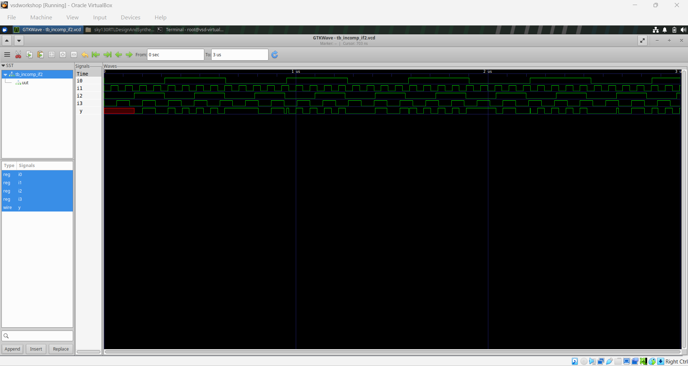

---

## 2.3 Incomplete CASE

An incomplete `case` statement can also infer a latch when some selector values do not assign the output.

Example:

```verilog
module incomp_case (
    input i0,
    input i1,
    input i2,
    input [1:0] sel,
    output reg y
);
always @(*)
begin
    case (sel)
        2'b00: y = i0;
        2'b01: y = i1;
    endcase
end
endmodule
```

The values `2'b10` and `2'b11` do not assign `y`.

### Synthesized Logic

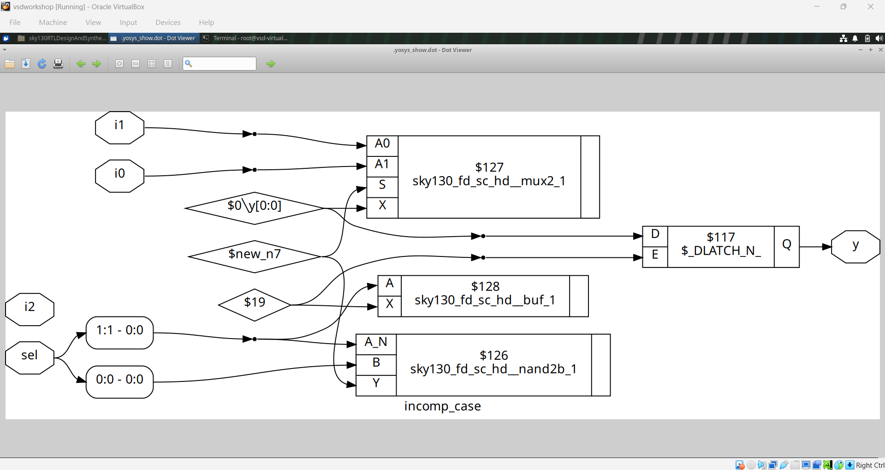

### Testbench Code

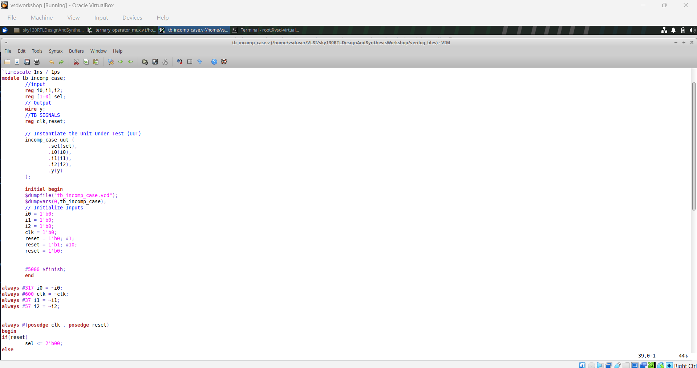

### Waveform


The synthesized result demonstrates the latch behavior caused by incomplete assignment.

---

# 3. Complete CASE Logic

## 3.1 Bad CASE Example

The `bad_case` experiment describes a multiplexer using a `case` statement.

### RTL Code

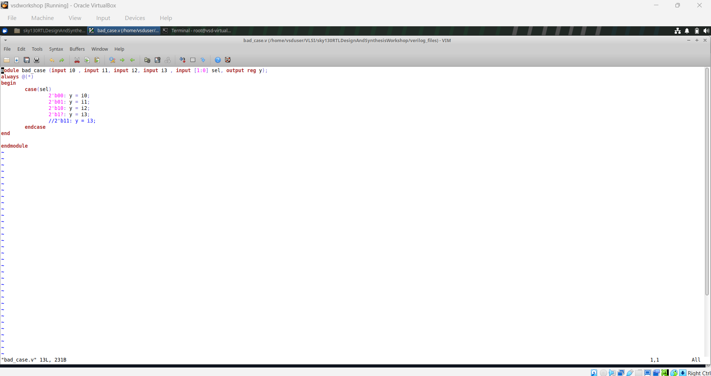

### Synthesized Logic

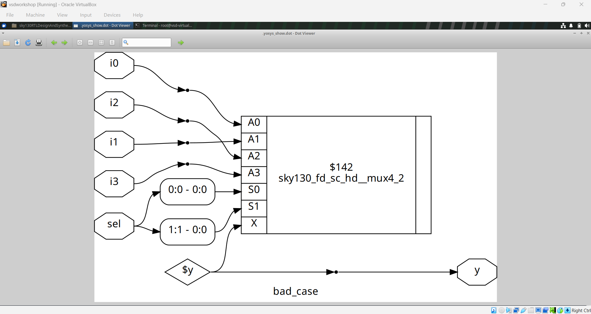

The synthesized diagram shows the MUX structure inferred from the selection logic.

### Testbench Waveform


---

## 3.2 Complete CASE Example

The `comp_case` experiment includes a `default` branch:

```verilog
module comp_case (
    input i0,
    input i1,
    input i2,
    input [1:0] sel,
    output reg y
);
always @(*)
begin
    case (sel)
        2'b00: y = i0;
        2'b01: y = i1;
        default: y = i2;
    endcase
end
endmodule
```

The `default` branch ensures that `y` receives a value for selector combinations not explicitly listed.

### RTL Code

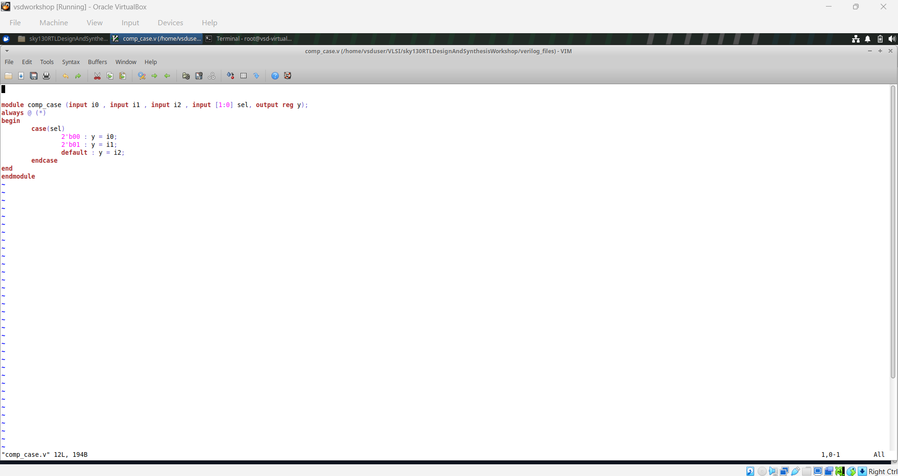

### Synthesized Logic


### Testbench Waveform


This experiment provides a comparison with incomplete case coding and demonstrates how complete assignment avoids unintended latch inference.

---

# 4. MUX and DEMUX Implementations

## 4.1 MUX Using Generate

The `mux_generate` experiment uses a loop/generate-style approach to represent a multiplexer.

### RTL Code

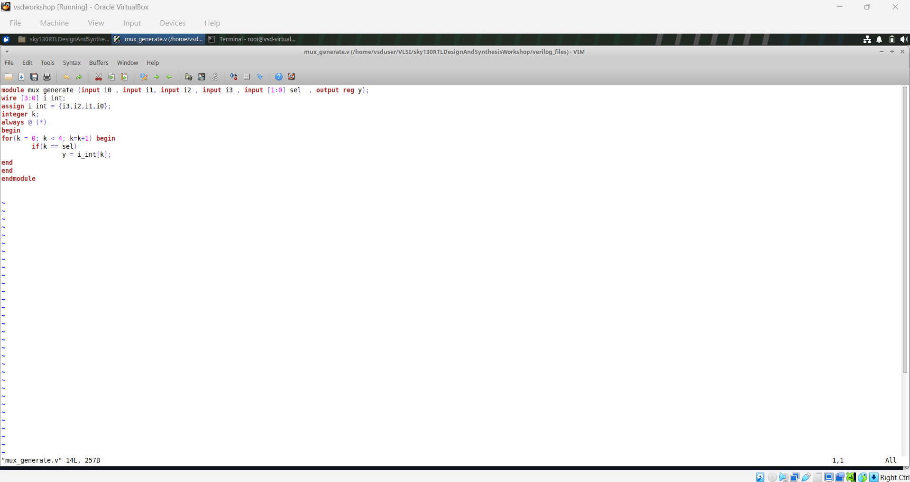

### Synthesized Logic


The synthesized result shows the hardware inferred from the RTL selection logic.

### Waveform

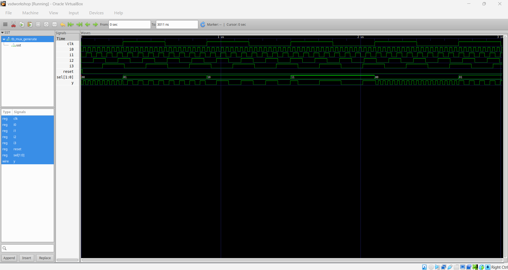

---

## 4.2 DEMUX Using CASE

A demultiplexer routes the input to one selected output.

The experiment uses an 8-output structure with a 3-bit selector.

### RTL Code


### Synthesized Logic

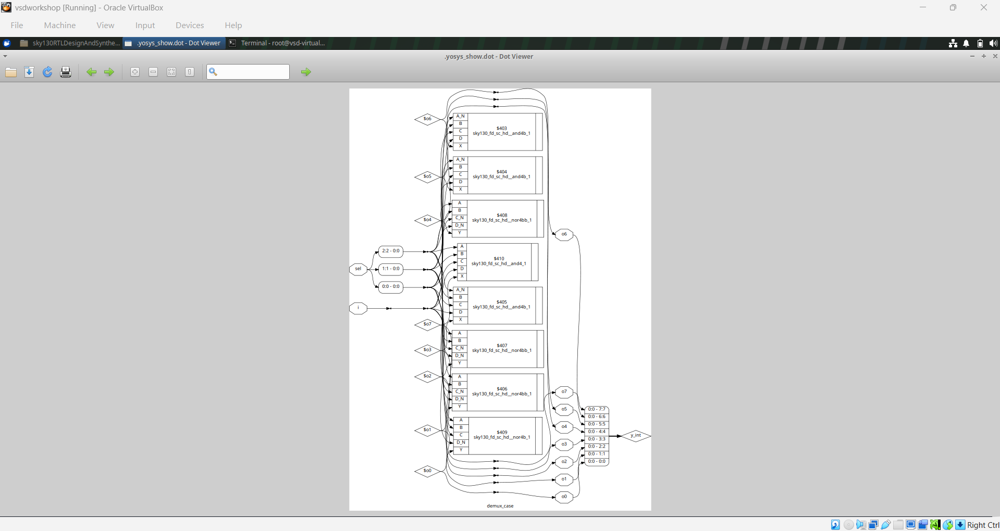

The synthesized logic demonstrates how the case-based RTL is converted into gate-level selection logic.

### Waveform

The supplied experiment set contains the corresponding demultiplexer simulation and synthesis evidence.

---

## 4.3 DEMUX Using Generate

The second demultiplexer implementation uses a loop-based/generate-style description.

### RTL Code


### Synthesized Logic


### Waveform


The generated implementation provides a useful comparison with the case-based demultiplexer.

---

# 5. Generate-Based Ripple Carry Adder

The supplied experiment also contains an RTL implementation of an 8-bit ripple-carry adder using a `generate` loop.

The structure connects full-adder instances together so that the carry from one stage becomes the carry input of the next stage.

The RTL contains signals similar to:

```verilog
wire [7:0] int_sum;
wire [7:0] int_co;

genvar i;
generate
    for (i = 1; i < 8; i = i + 1)
    begin
        // Full-adder instances
    end
endgenerate
```

The final sum combines the generated intermediate sum bits and the final carry.

### RTL Screenshot


The experiment demonstrates how `generate` constructs can be used to describe repeated hardware structures.

---

# 6. Simulation and Verification

The experiments use simulation waveforms to verify RTL behavior and synthesized logic diagrams to inspect the inferred hardware.

A simplified synthesis-oriented flow is:

```text
RTL Coding
    |
    v
RTL Simulation
    |
    v
Synthesis
    |
    v
Inspect Inferred Hardware
    |
    +----> Latch / MUX / Gate Logic
    |
    v
Post-Synthesis Verification
```

The module specifically demonstrates that:

- Incomplete combinational assignments can infer latches.
- Complete `case` descriptions can avoid unintended storage.
- MUX and DEMUX structures can be inferred from behavioral RTL.
- Generate constructs can describe repeated hardware.
- The synthesized netlist may use standard-cell MUX, latch and logic-gate cells.

---

# 7. Key Takeaways

This module provides practical understanding of:

- Synthesis-oriented RTL coding
- Incomplete `if` statements
- Incomplete `case` statements
- Latch inference
- Complete `case` coding
- `default` branches
- MUX inference
- DEMUX implementation
- Generate-based hardware description
- Structural repetition using `generate`
- Synthesized standard-cell inspection
- RTL waveform verification

The main lesson is that **RTL coding style directly influences the hardware inferred by synthesis**. For combinational logic, every possible input condition should be handled when unintended storage is not required.
