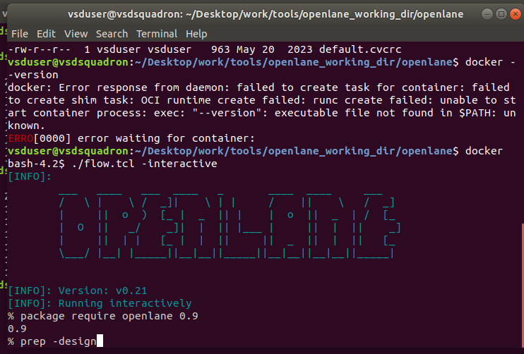
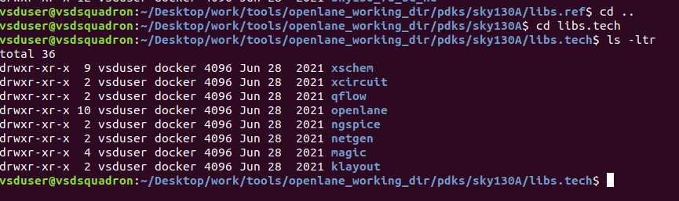
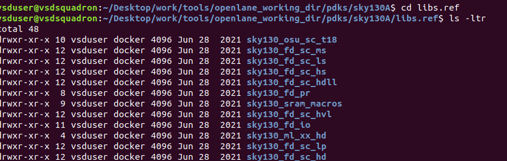
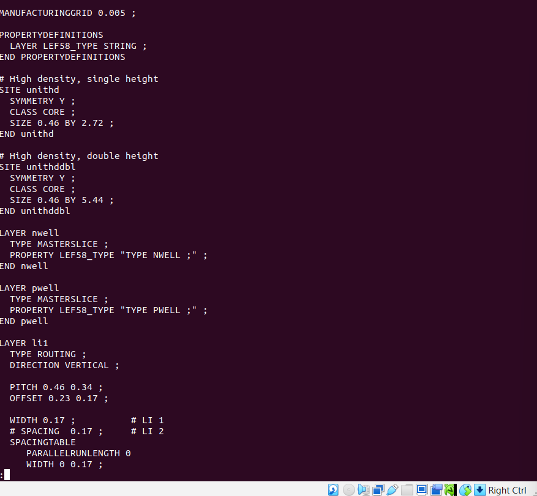
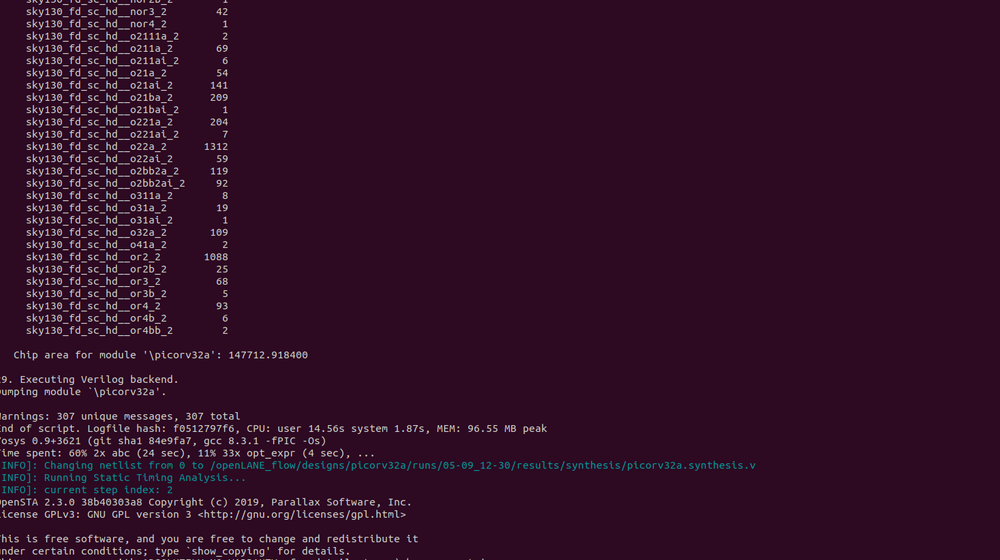
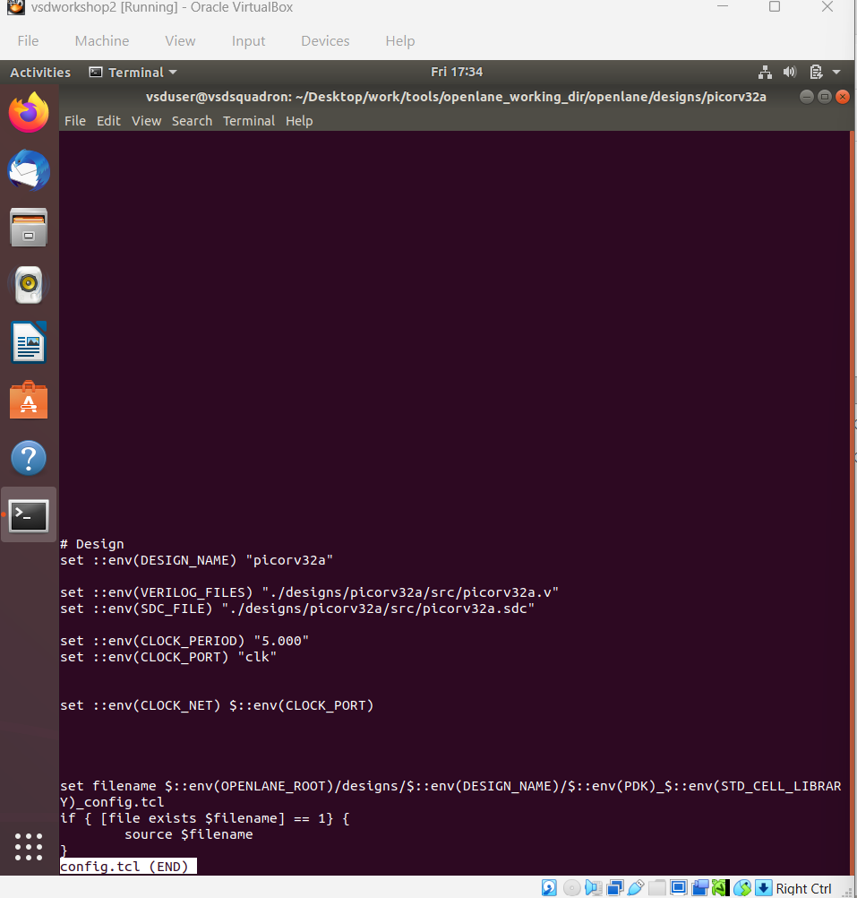
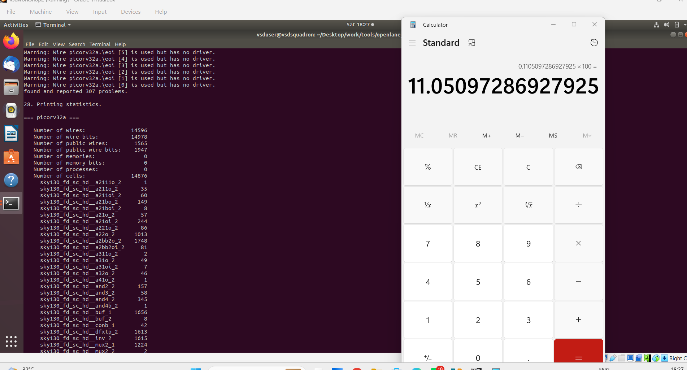

# Module 1 – Inception of Open-Source EDA, OpenLANE and Sky130 PDK

## Overview

Module 1 introduces the foundation of the physical-design flow using open-source EDA tools, OpenLANE and the Sky130 PDK.

The module focuses on understanding how digital designs are represented, how SoC design connects RTL and physical implementation, and how open-source tools are used in the design flow.

## Topics Covered

### 1. How to Talk to Computers

This section introduces the basic interaction between a hardware designer and computer-based design tools. Commands, design files, libraries and tool flows are used to convert a hardware description into implementation data.

### 2. SoC Design and OpenLANE

OpenLANE provides an automated open-source RTL-to-GDSII flow. It connects several stages of digital implementation, including synthesis and physical-design steps.

### 3. Get Familiar with Open-Source EDA Tools

The workshop provided practical exposure to the open-source tools and the Linux command-line environment used to run the physical-design flow.

### 4. Sky130 PDK

The Sky130 process design kit provides the technology information and libraries required for implementing a design using the Sky130 process.

### 5. Tool-Specific and Technology-Specific Information

The practical work included understanding information that is specific to the selected EDA tools and to the target technology.







## Practical Parameters Studied

### Layer Information

The workshop included examination of physical-design layer information.



### Chip Area

Chip-area information was observed as part of understanding physical implementation requirements.



### Default Clock Period

Clock constraints are important for timing-driven implementation. The practical work included observing the default clock-period setting.



### Clock Ratio and Percentage

Clock-related ratio and percentage information was also examined during the practical work.



## Module 1 Flow

```text
Open-Source EDA
      ↓
Linux Environment
      ↓
OpenLANE
      ↓
Sky130 PDK
      ↓
Technology / Tool Information
      ↓
Design Parameters
      ↓
Physical Design Flow
```

## Learning Outcome

After completing Module 1, the practical work provided an understanding of:

- Open-source EDA concepts
- OpenLANE and its role in SoC implementation
- Sky130 PDK basics
- Tool-specific and technology-specific information
- Physical layers
- Chip-area information
- Basic clock parameters

## Conclusion

Module 1 established the foundation required to continue into physical-design implementation. The practical screenshots document the OpenLANE, Sky130 and design-parameter concepts covered during the workshop.
