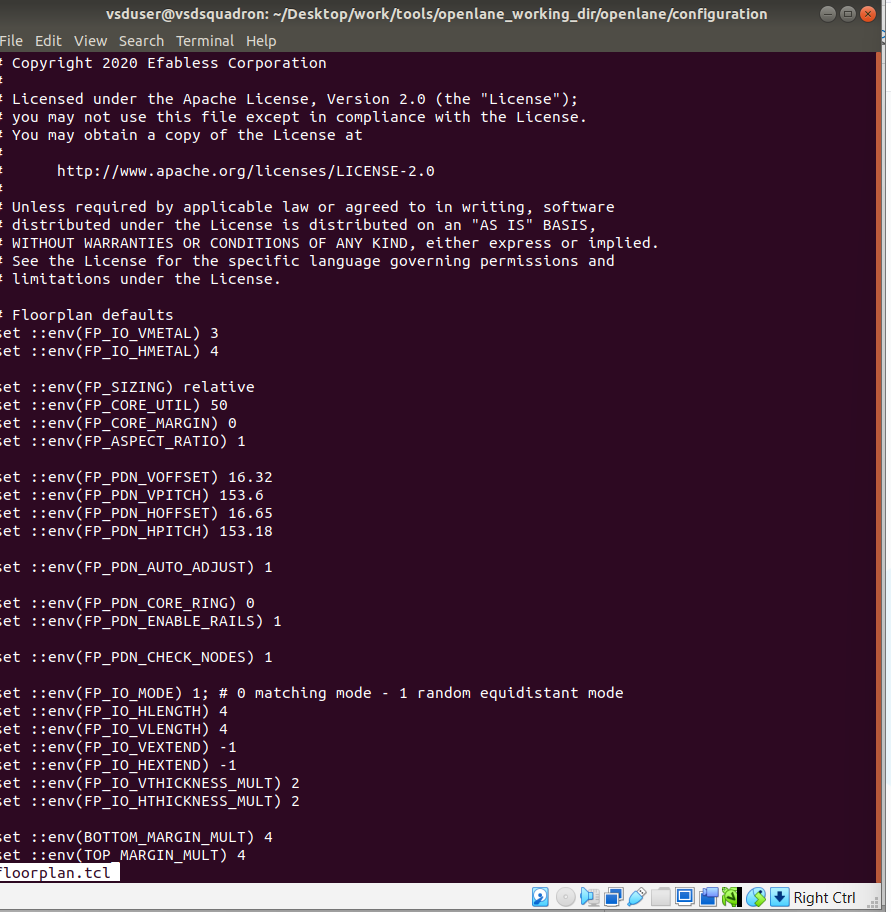
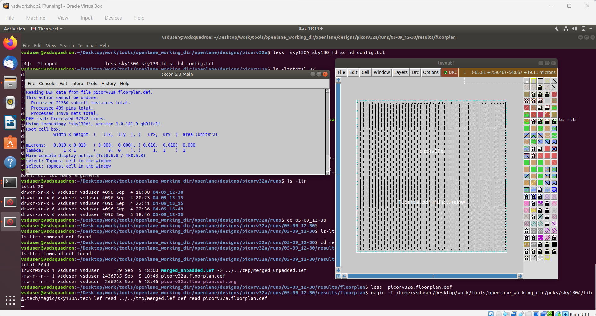
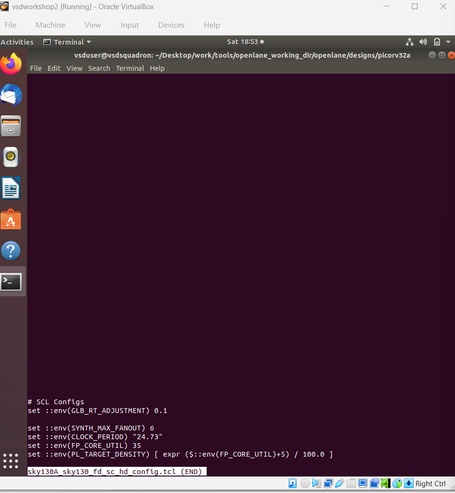
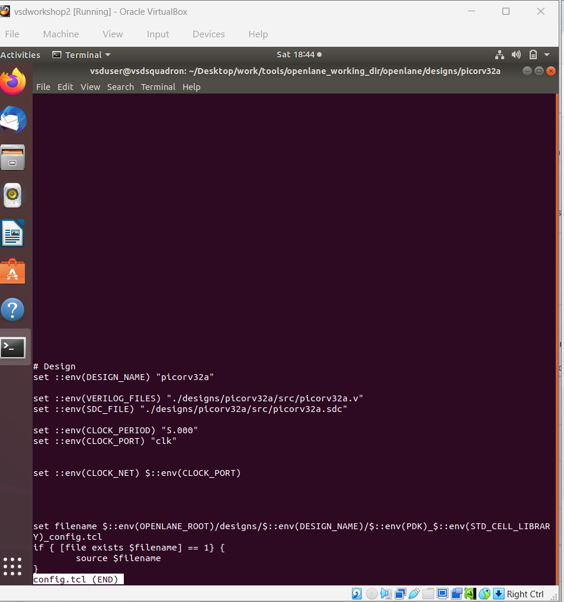
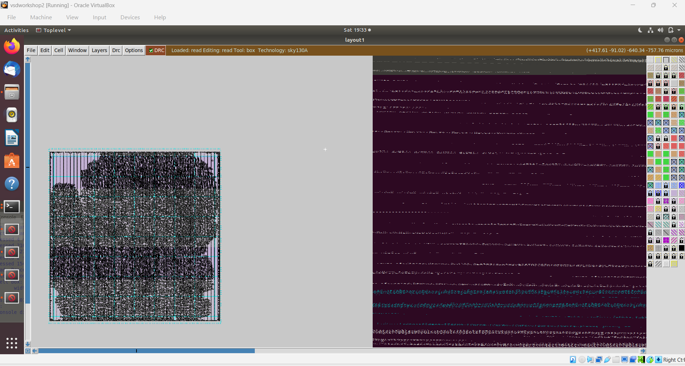
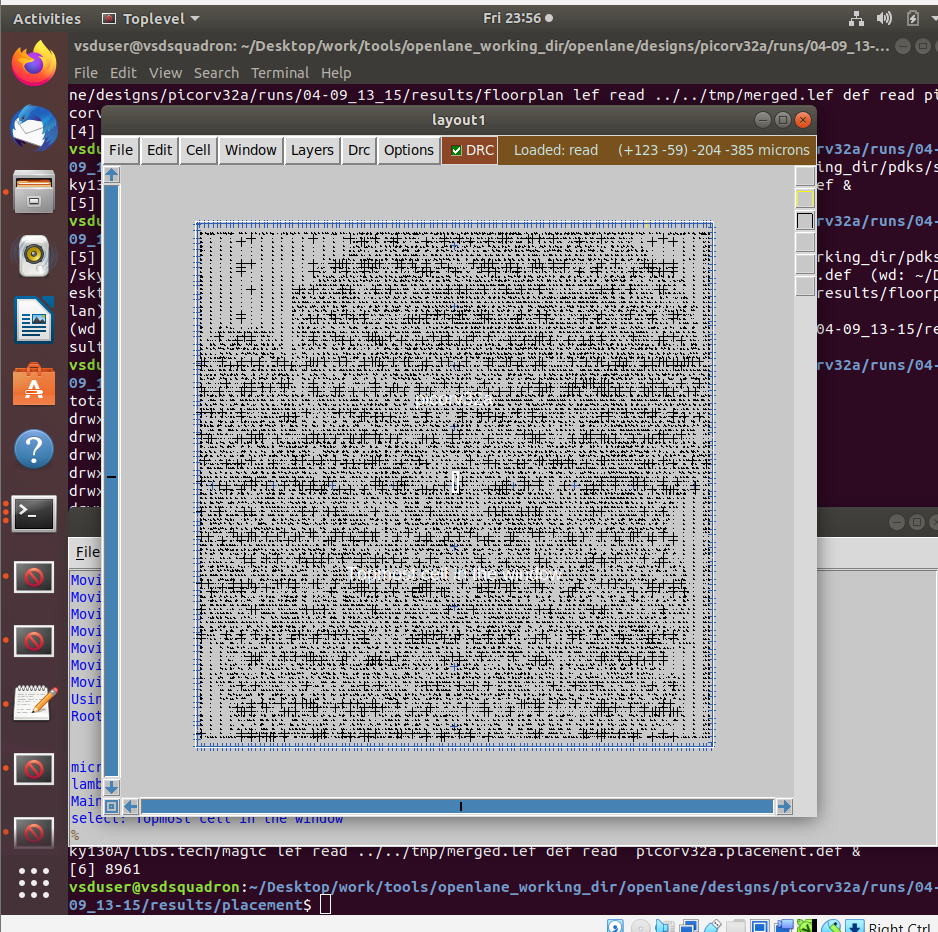
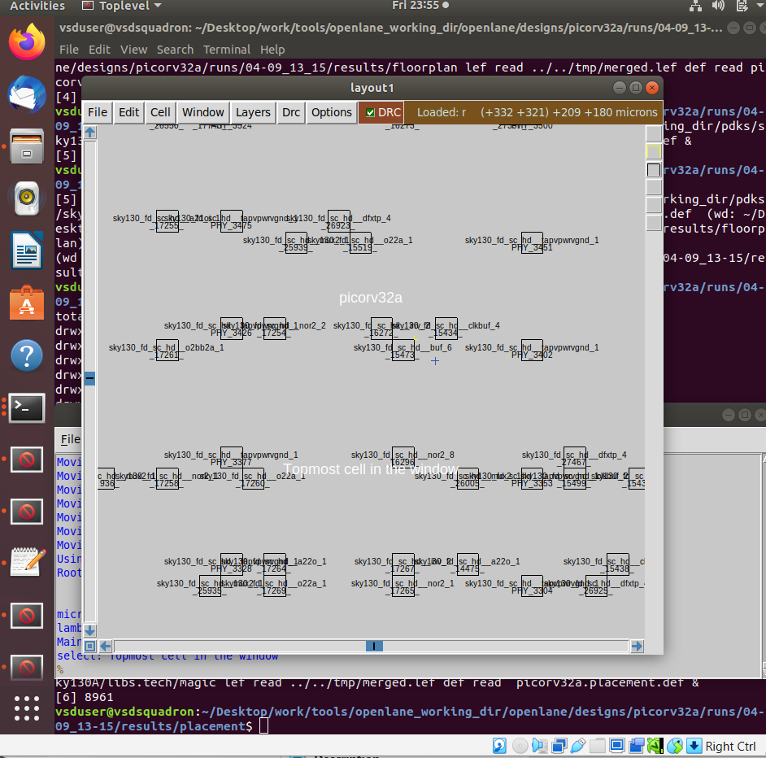
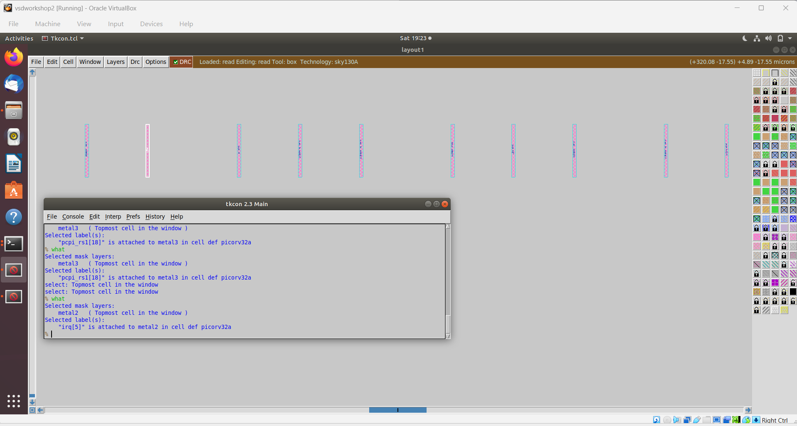
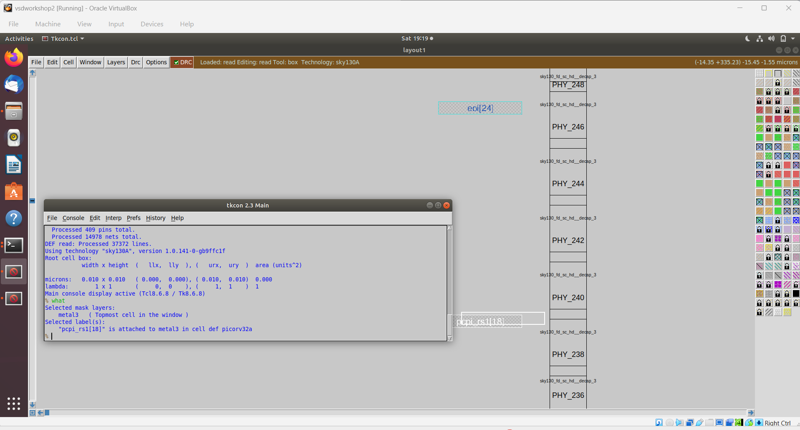
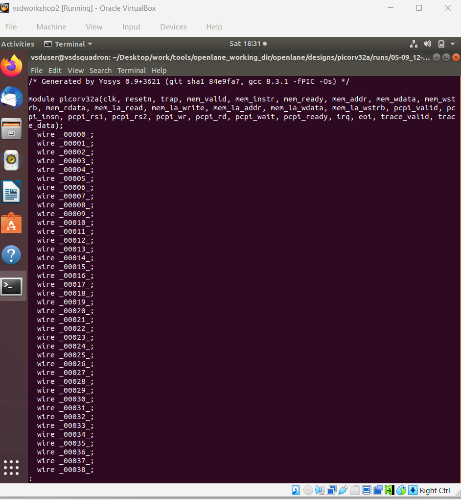

# Module 2 – Floorplanning and Introduction to Library Cells

## Overview

Module 2 focuses on physical floorplanning, utilization and aspect ratio, placement, standard-cell libraries, physical layers and introductory cell characterization concepts.

## Topics Covered

### 1. SKY130_D2_SK1 – Chip Floorplanning Considerations

Floorplanning is an important physical-design stage in which the overall arrangement of the design is planned before detailed placement and routing.

The practical work included floorplan views and their visualization using Magic.





### 2. SKY_L1 – Utilization Factor and Aspect Ratio

Two important floorplanning parameters are:

- **Utilization Factor:** the portion of the available core area occupied by the placed standard cells.
- **Aspect Ratio:** the relationship between the height and width of the core area.

These parameters influence the available placement area and the physical shape of the design.

### 3. Cell Design and Characterization Flows

Standard cells must be represented with the information required by digital implementation tools. Cell design and characterization provide the physical and timing information needed for using cells in the design flow.

The Sky130 library information used during the practical work is shown below.



### 4. General Timing Characterization Parameters

Timing characterization describes how a cell behaves under different input and output conditions. Important timing concepts include propagation delay, transition/slew and timing relationships between input and output signals.

The practical module introduced these characterization concepts together with library-cell and physical-layer views.

## Practical Placement Work

### Design Name

The design name and implementation information were examined during the physical-design flow.



### Standard-Cell Placement

Standard cells are placed inside the floorplanned core area while observing physical-design constraints.



### Magic Placement

Magic was used to view the physical implementation and placement of the design.





## Physical Layers

The practical work included selecting and examining individual physical mask layers, including metal layers.

### Metal 2



### Metal 3



## Synthesis Netlist

The synthesized netlist was also observed as part of connecting the logical implementation to the physical-design stages.



## Module 2 Flow

```text
Synthesis Netlist
      ↓
Floorplanning
      ↓
Utilization Factor
      ↓
Aspect Ratio
      ↓
Standard-Cell Placement
      ↓
Magic Physical View
      ↓
Physical / Mask Layers
      ↓
Library Cell Understanding
      ↓
Timing Characterization Concepts
```

## Learning Outcome

The practical work in Module 2 provided an understanding of:

- Chip floorplanning considerations
- Utilization factor
- Aspect ratio
- Standard-cell placement
- Sky130 library-cell information
- Physical mask layers
- Magic layout views
- Cell design and characterization concepts
- General timing characterization parameters
- Relationship between synthesis and physical implementation

## Conclusion

Module 2 extended the workshop from the introductory OpenLANE and Sky130 concepts into physical implementation. The practical screenshots demonstrate floorplanning, placement, standard-cell and library views, mask-layer inspection and synthesized-netlist information.
