# VLSI Design, Synthesis, MUX, GLS and VSD BabySoC Lab Work

---

## About This Repository

This repository contains the VLSI Design and Synthesis laboratory work completed during the workshop. The work demonstrates the practical RTL-to-gate-level design flow, including Verilog RTL coding, testbench creation, functional simulation, waveform analysis, Yosys synthesis, logic optimization, technology mapping, Gate-Level Simulation (GLS), and VSD BabySoC synthesis and verification.

The laboratory work includes Good MUX and Bad MUX experiments, hierarchical design, SKY130 standard-cell technology mapping, BabySoC simulation, gate-level netlist inspection, and comparison of pre-synthesis and post-synthesis results.

## Tools Used

- Verilog HDL
- GVim / VI
- Icarus Verilog
- GTKWave
- Yosys
- SKY130 Standard-Cell Library
- Linux Terminal
- VSD BabySoC Environment

---

# Complete VLSI Design Flow

```text
RTL Design
    ↓
Verilog Coding
    ↓
Testbench
    ↓
RTL / Functional Simulation
    ↓
Icarus Verilog
    ↓
VCD Generation
    ↓
GTKWave
    ↓
Yosys Synthesis
    ↓
Logic Optimization
    ↓
Technology Mapping
    ↓
Gate-Level Netlist
    ↓
Gate-Level Simulation
    ↓
GTKWave Verification
```

### Final Practical Flow

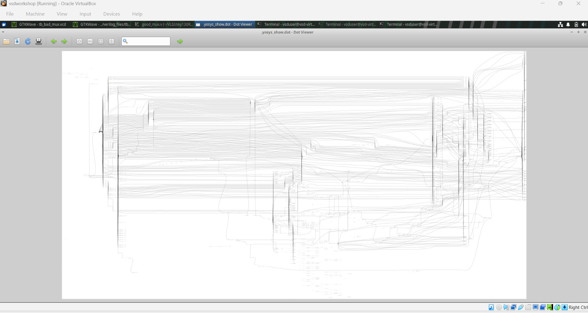

---

# 1. File Structure and Design Hierarchy

The laboratory work was organized using Verilog source files, testbenches, libraries and synthesis/simulation files.

### File Structure


### Design Hierarchy

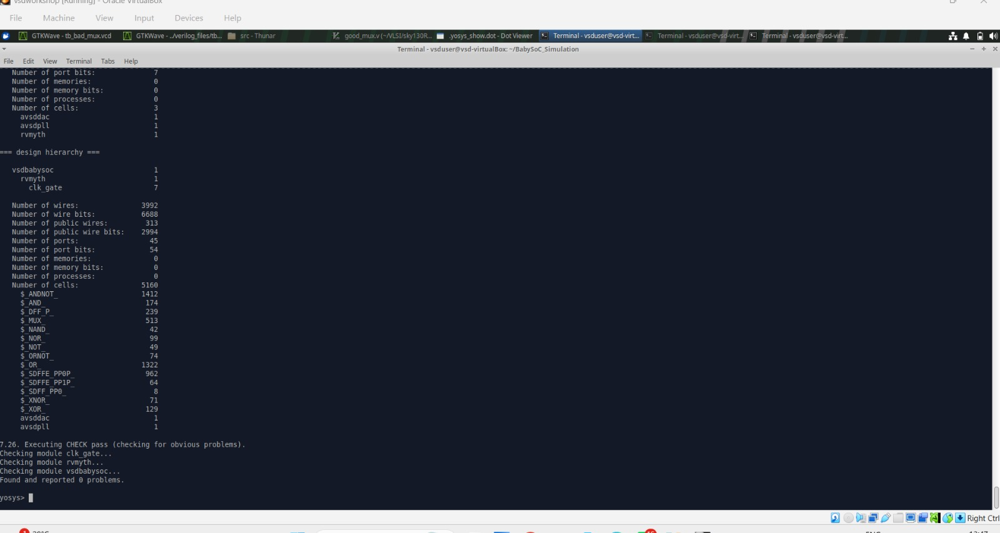

The hierarchical design approach helps divide a larger hardware design into smaller and reusable modules.

---

# 2. MUX Design

A multiplexer was implemented using Verilog HDL as a combinational circuit.

A basic 2:1 MUX can be represented as:

```verilog
assign y = sel ? i1 : i0;
```

### MUX Code


### Good MUX


---

# 3. Good MUX Functional Simulation

The Good MUX was simulated using Icarus Verilog. The resulting waveform was viewed using GTKWave to check the functional behavior.

### Simulation Waveform


---

# 4. Good MUX Technology Mapping

After RTL simulation, the Good MUX was synthesized and mapped to cells from the SKY130 standard-cell library.

### Technology-Mapped MUX

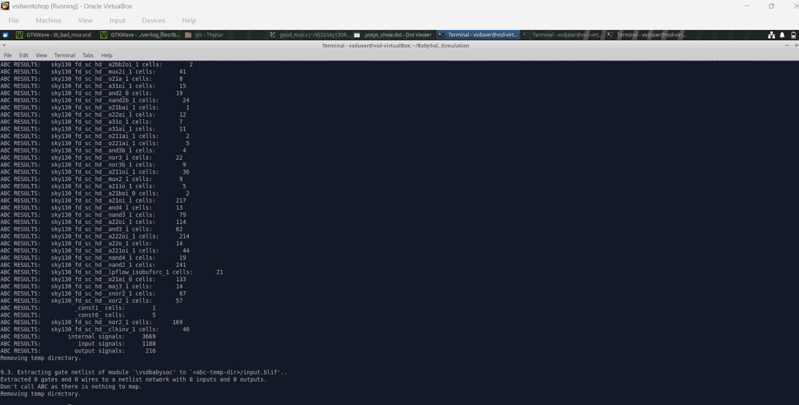

---

# 5. Bad MUX and Comparison

A Bad MUX implementation was studied to understand how RTL coding style can affect simulation and synthesis behavior.

### Good MUX vs Bad MUX

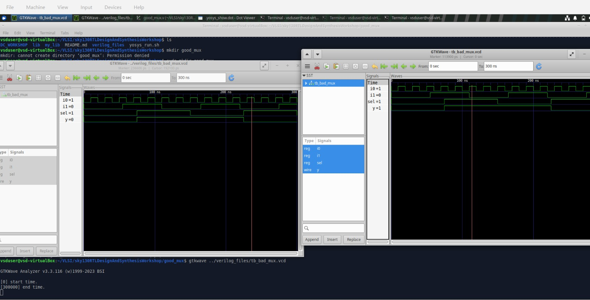

---

# 6. MUX Design, Optimization and Gate-Level Simulation

The MUX experiment was extended through synthesis, optimization and gate-level verification.

```text
RTL MUX
   ↓
Functional Simulation
   ↓
Yosys Synthesis
   ↓
Logic Optimization
   ↓
Technology Mapping
   ↓
Gate-Level Netlist
   ↓
Gate-Level Simulation
   ↓
GTKWave Verification
```

### MUX Design, Optimization and GLS

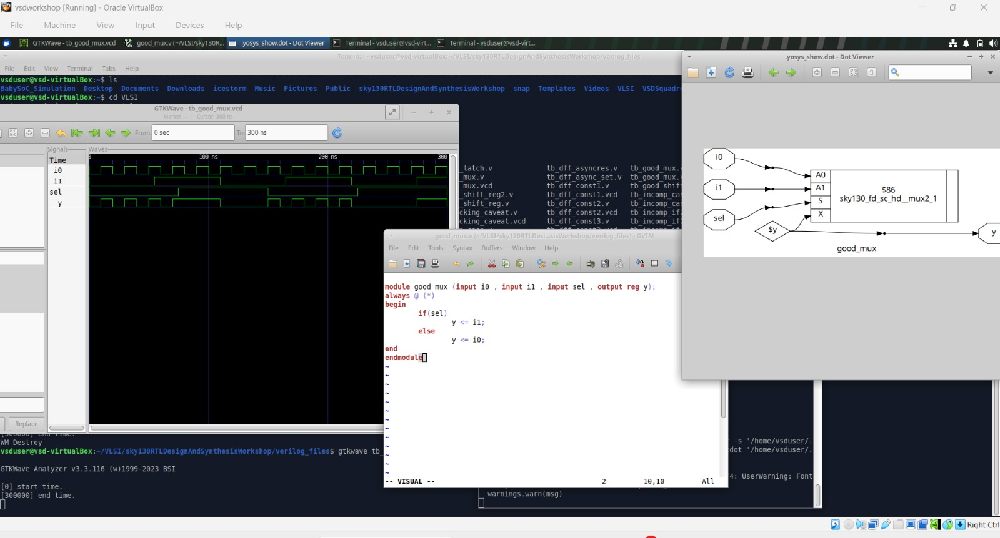

---

# 7. Gate-Level Simulation (GLS)

Gate-Level Simulation was performed using the synthesized gate-level netlist together with the required standard-cell models and testbench.

```text
Gate-Level Netlist
       +
SKY130 Cell Models
       +
Testbench
       ↓
Icarus Verilog
       ↓
VCD
       ↓
GTKWave
```

### GLS / Pre-Synthesis Waveform

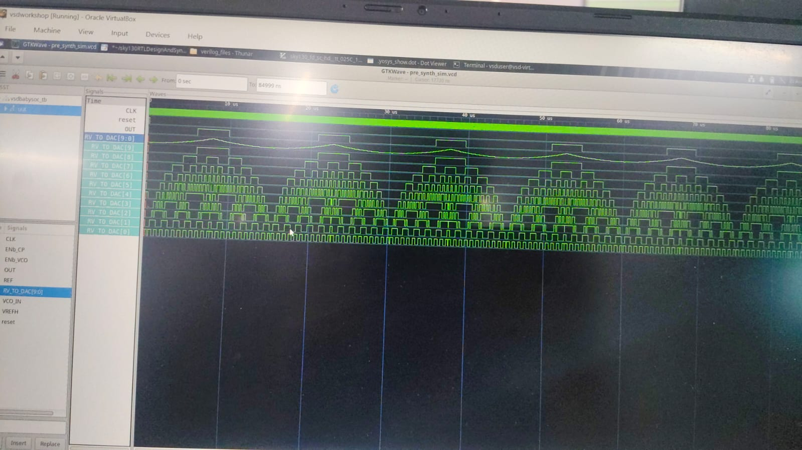

### Gate Checking

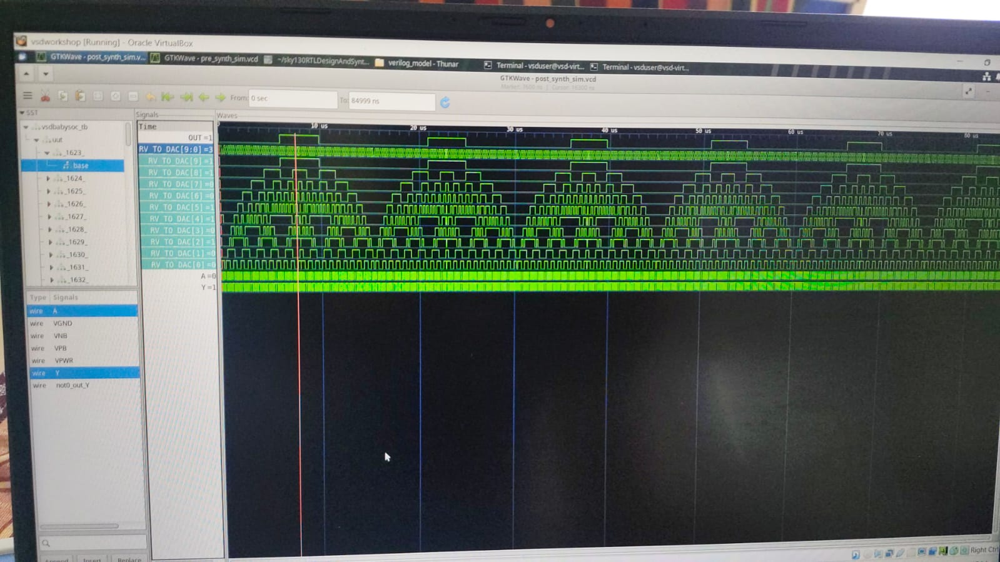

---

# 8. VSD BabySoC

The VSD BabySoC experiment was used to apply the RTL-to-synthesis flow to a larger practical System-on-Chip design.

### RVMYTH

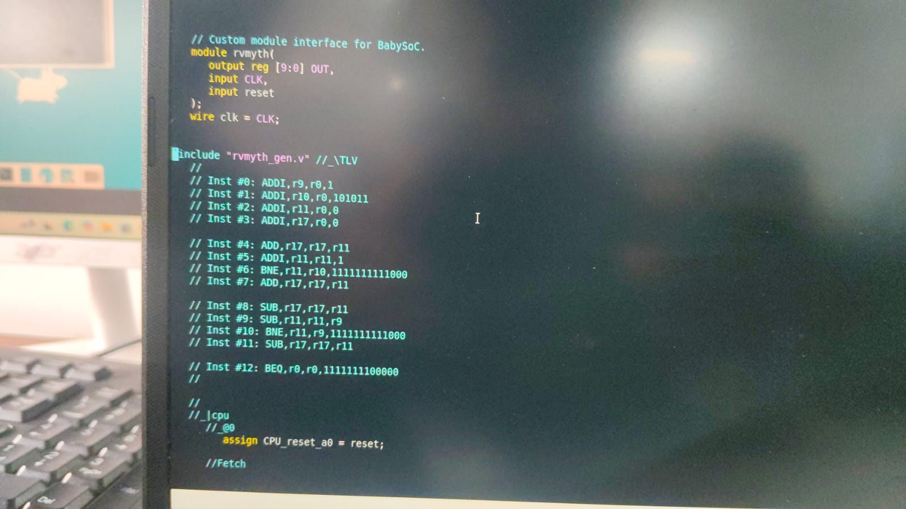

### BabySoC Design


---

# 9. BabySoC Synthesis

The BabySoC RTL design was processed through Yosys synthesis and technology mapping.

```text
BabySoC RTL
    ↓
Read Verilog Files
    ↓
Read Standard-Cell Library
    ↓
Synthesis
    ↓
Optimization
    ↓
Technology Mapping
    ↓
Gate-Level Netlist
```

### BabySoC Synthesized Design

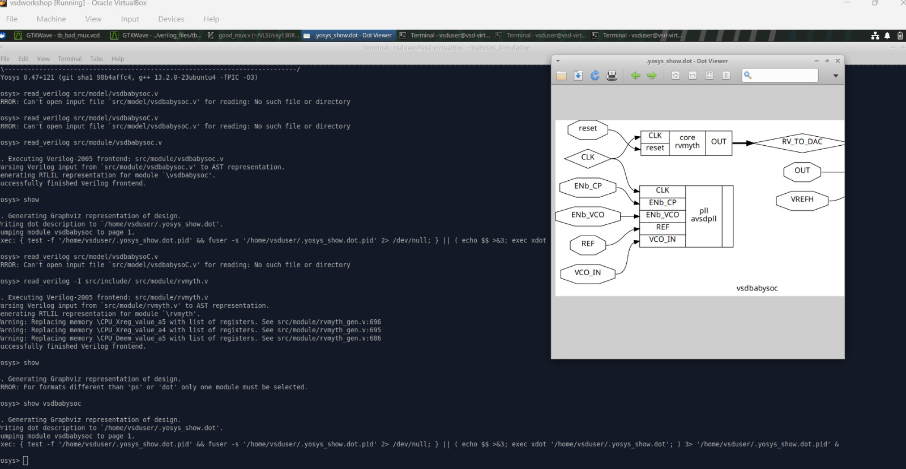

---

# 10. BabySoC Synthesis Statistics

Yosys statistics were inspected to understand the synthesized design and the resulting hardware structure.

### Synthesis Statistics

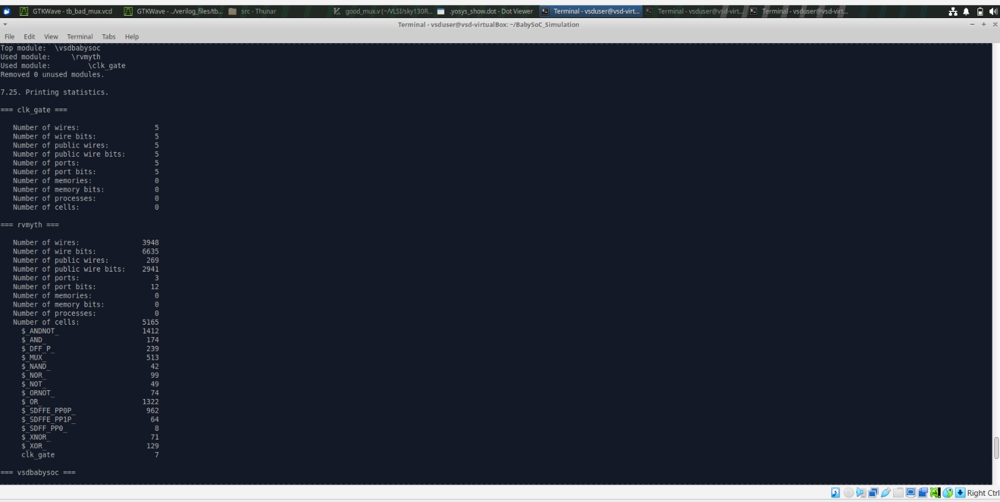

---

# 11. BabySoC Gate-Level Netlist

The synthesized BabySoC gate-level netlist was inspected as part of the post-synthesis verification process.

### BabySoC Netlist

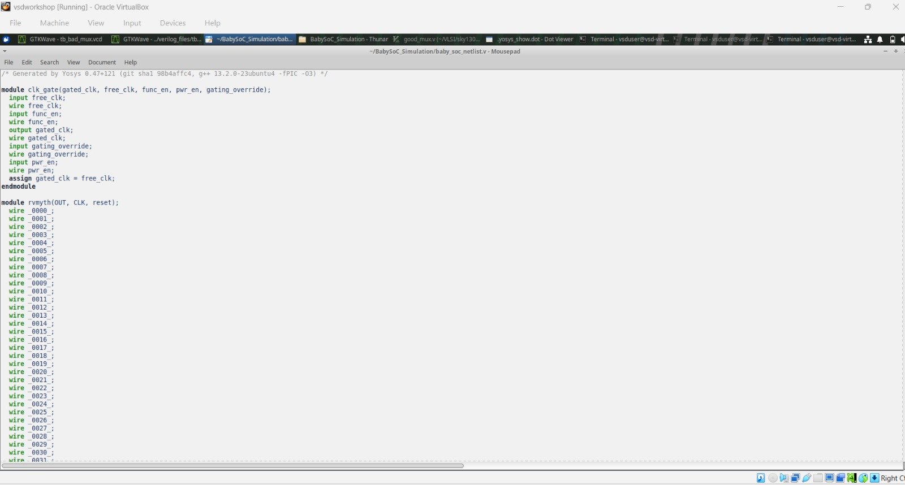

### BabySoC Netlist – Additional View

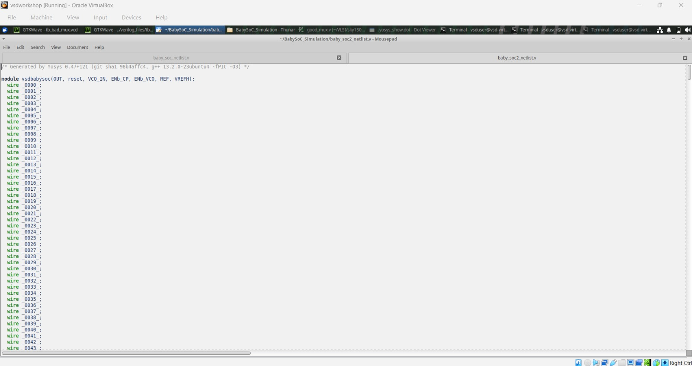

---

# 12. BabySoC Post-Synthesis Simulation

The BabySoC post-synthesis simulation was observed using the simulation environment and waveform analysis flow.

### Post-Synthesis Simulation


---

# 13. Pre-Synthesis and Post-Synthesis Comparison

The pre-synthesis and post-synthesis simulation results were compared to verify functional consistency between the RTL design and the synthesized implementation.

### Comparison

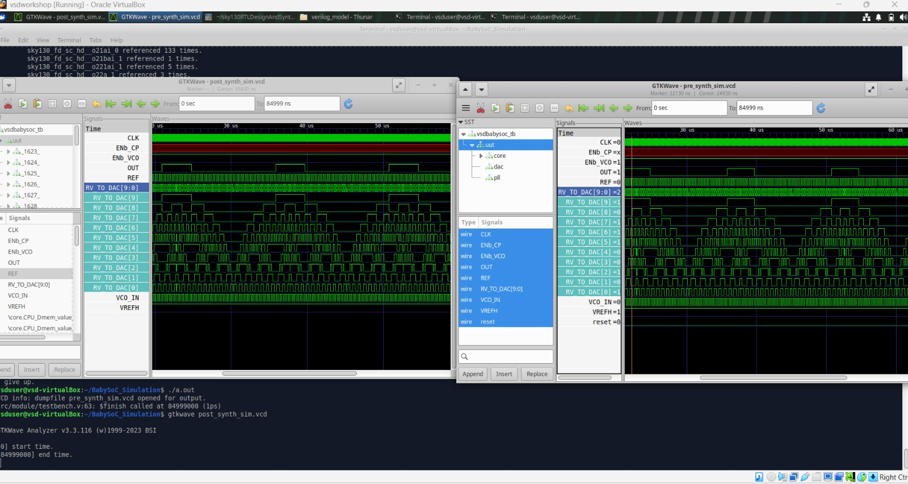

---

# 14. Testbench

A testbench was used to provide input stimulus and verify the behavior of the design during simulation.

### Testbench File

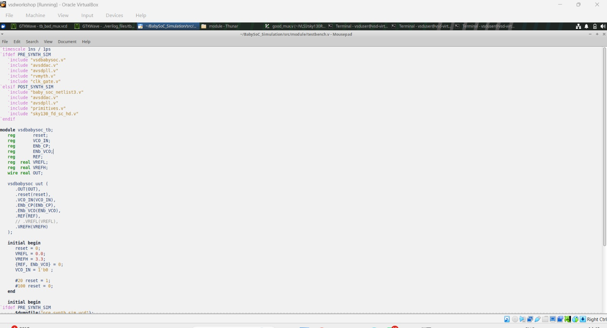

---

# 15. Leakage Power Information

The SKY130 Liberty library contains electrical and timing information associated with standard cells. Leakage power information was inspected as part of understanding standard-cell library data.

### Leakage Power Information

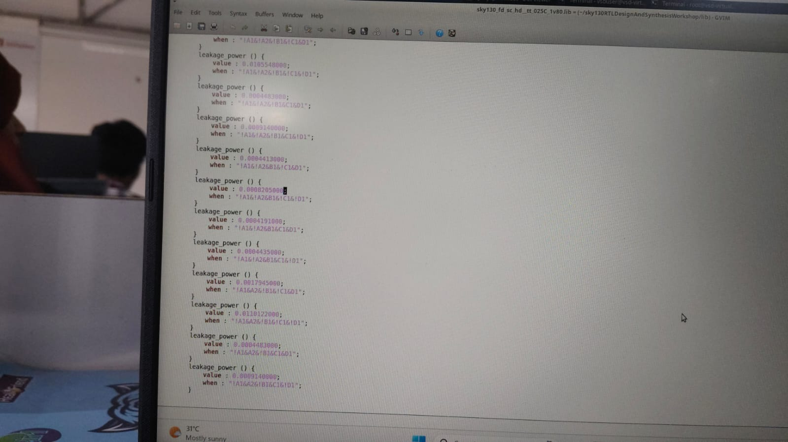

---

# 16. Important Yosys Commands

### Start Yosys

```bash
yosys
```

### Read Verilog

```bash
read_verilog <file.v>
```

### Read Liberty Library

```bash
read_liberty -lib <library.lib>
```

### Synthesis

```bash
synth -top <top_module>
```

### DFF Library Mapping

```bash
dfflibmap -liberty <library.lib>
```

### ABC Technology Mapping

```bash
abc -liberty <library.lib>
```

### Optimization

```bash
opt
```

### Display Synthesized Design

```bash
show
```

### Flatten Design

```bash
flatten
```

### Replace Undefined Values

```bash
setundef -zero
```

### Clean Unused Logic

```bash
clean -purge
```

### Rename Objects

```bash
rename -enumerate
```

### View Statistics

```bash
stat
```

### Write Gate-Level Netlist

```bash
write_verilog -noattr <netlist.v>
```

---

# 17. Workshop / Training

The laboratory work was performed as part of the VLSI design and synthesis training environment.

### Trainer

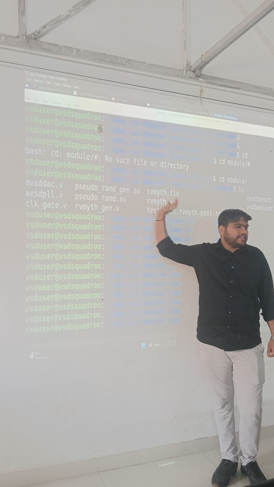

---

# Conclusion

This laboratory work provided practical experience with the RTL-to-gate-level VLSI design flow.

The experiments covered:

- Verilog RTL coding
- Testbench creation
- Functional simulation
- GTKWave waveform analysis
- Yosys synthesis
- Logic optimization
- SKY130 technology mapping
- Good MUX and Bad MUX comparison
- Gate-Level Simulation
- VSD BabySoC synthesis
- Gate-level netlist inspection
- Pre-synthesis and post-synthesis comparison
- Standard-cell leakage power information

The complete practical progression was:

```text
RTL DESIGN
    ↓
FUNCTIONAL SIMULATION
    ↓
GTKWAVE
    ↓
YOSYS SYNTHESIS
    ↓
OPTIMIZATION
    ↓
TECHNOLOGY MAPPING
    ↓
GATE-LEVEL NETLIST
    ↓
GLS
    ↓
WAVEFORM VERIFICATION
    ↓
VSD BABYSOC
    ↓
PRE-SYNTHESIS SIMULATION
    ↓
POST-SYNTHESIS SIMULATION
    ↓
PRE/POST COMPARISON
```

---

**Author:** B.SANGATHRAM 
**Department:** Electronics and Communication Engineering (ECE)  
**Institution:** Anurag University
